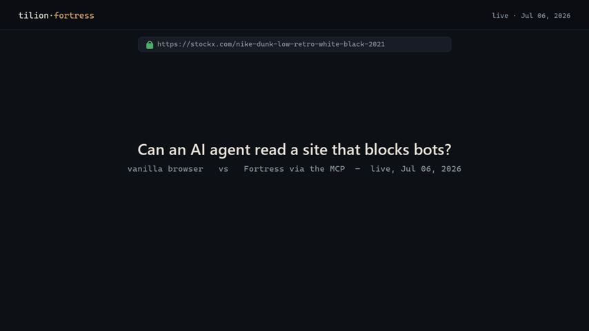

# Fortress MCP — a stealth browser for AI agents

> **Beta** · 26 tools · runs **local & free** · **hosted cloud coming soon**

An [MCP](https://modelcontextprotocol.io) server that gives any AI agent the **Fortress
stealth engine** the moment it gets blocked. When a fetch hits Cloudflare, DataDome,
PerimeterX, a 403, or a CAPTCHA, the agent calls these tools and gets the page — driving a
real, recompiled Chromium on your own machine and IP.

<p align="center"></p>

<sub><i>Real, dated run against <b>stockx.com</b> (PerimeterX). A stock browser gets <b>HTTP 403 — “Access denied”</b>; an agent with the Fortress MCP returns clean JSON. Reproduce with the demo scripts in the framework repo.</i></sub>

## Install

```bash
pip install "tilion[mcp]"        # pulls the Fortress engine (tilion-fortress) automatically
tilion-mcp                       # or:  python -m tilion.mcp   (stdio transport)
```

The MCP server is a thin, open wrapper (BSD-3) over the `tilion` framework, which drives the
Fortress engine. The stealth Chromium downloads on first run and is cached locally.

## Add to your client

**Claude Desktop / Cursor** — add to the MCP config:

```json
{ "mcpServers": { "fortress": { "command": "tilion-mcp" } } }
```

**Cline / Windsurf** (VS Code settings → MCP servers):
```json
{ "fortress": { "command": "tilion-mcp" } }
```

If `tilion-mcp` isn't on PATH, use `"command": "python", "args": ["-m", "tilion.mcp"]`.

## The 26 tools

| Tool | What the agent uses it for |
|---|---|
| `fetch_protected_page` | get a page behind Cloudflare / DataDome / 403 / CAPTCHA |
| `read_page` | clean reader-mode **markdown of any page** (+ tables) |
| `extract_page` | markdown + tables + metadata (or a schema-shaped record) |
| `extract_document` | extract a PDF/DOCX/XLSX/CSV/HTML file (path or URL) → markdown |
| `page_elements` | the page's buttons / links / fields / headings |
| `click_button` · `fill_field` · `press_key` | drive a form by visible text / selector / key |
| `current_page` · `get_page_html` · `evaluate_js` · `wait_for` | inspect / script / wait on the working page |
| `crawl_site` | crawl a whole site (auto-handles SPA/JS) → pages + sitemap |
| `recon_site_apis` | reverse-engineer a site's private XHR/JSON API (secret-scrubbed) |
| `run_browser_task` · `list_browser_tasks` | 20 multi-step flows: login, paginate, infinite-scroll, checkout… |
| `search_web` | web search through the stealth browser (no SERP API) |
| `screenshot_page` · `save_page` · `download_file` | capture PNG / export pdf·html·text / download a file |
| `get_cookies` · `save_profile` · `load_profile` | read cookies · persist/restore an authenticated session |
| `list_tabs` · `close_tab` | manage open tabs |
| `get_stealth_cdp_endpoint` | a CDP url to point your OWN browser-use / Playwright / Puppeteer at |

Tools are **annotated** (`readOnlyHint` / `destructiveHint`) so clients auto-approve reads
and gate writes. Every tool is **timeout- and SSRF-guarded**, caps its output, and returns a
structured error instead of hanging. The browser is **pre-warmed at startup**, so the first
call is ~100 ms.

## Why reach for it — benchmarks

Real head-to-head — an agent with only its built-in web fetch vs. the same task through the
Fortress MCP:

| Task | Built-in web fetch | **Fortress MCP** |
|------|--------------------|------------------|
| Reddit r/programming titles | ✗ 0 items | **✓ 26 titles** |
| JS-rendered page (quotes) | ✗ 0 quotes | **✓ 10 quotes** |
| Wikipedia article | ✗ 403 to bots | **✓ 52 k markdown** |
| Hacker News top stories | ✓ 30 · 24 s | **✓ 30 · 2 s** (~12× faster) |

Fingerprint suites: **Sannysoft all-green · CreepJS 0% headless · BrowserScan “Normal.”**

## Configuration (env)

| Env var | Default | Effect |
|---|---|---|
| `TILION_MCP_PREWARM` | `1` | boot the browser at startup; `0` = lazy |
| `TILION_MCP_HEADLESS` | `1` | `0` to show a visible window |
| `TILION_ALLOW_PRIVATE_EGRESS` | `0` | `1` to allow localhost / private IPs (SSRF guard off) |
| `TILION_MCP_TOOL_TIMEOUT` | `120` | per-tool wall-clock cap (seconds) |
| `TILION_BASE_URL` / `TILION_API_KEY` | — | hosted mode (**coming soon**) |

## How it works

`tilion-mcp` → the `tilion` framework (local mode) → attaches over CDP to the Fortress
engine. Stealth is applied **natively in the C++ engine**, so there's no detectable JS
injection. One warm browser backs every tool for the server's lifetime.

Registry manifests: [`server.json`](server.json) (MCP registry) · [`smithery.yaml`](smithery.yaml) (Smithery).
Agent skill: [`skill/SKILL.md`](skill/SKILL.md).

## License

BSD-3-Clause (the MCP server and framework funnel). The engine binary ships via
`tilion-fortress`. Hosted cloud with residential egress is coming soon.
